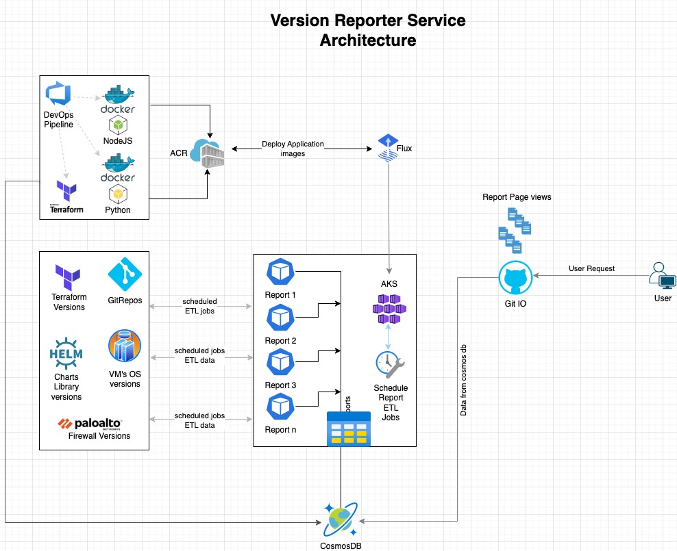

# Version Reporter Services
The Version Reporter Service MicroServices Project is a work-in-progress abd this README will be updated
in a little while.

## General Idea
The general idea is to have a repo the build the various microservices container images and puch them
to the container registry. The application will be configured to run via the `cnp-flux-config` repo where
all the relevant cluster configuration will be setup to use the images generate by this repo.

Each report could be a different technology e.g. Node, Python, Bash or Powershell.
The output would be a container image in ACR.

### High level Architecture plan

  
VRS Proposed Plan

  

_**Note** This may change as conversations around this picks up._

## Documentation place holders
- Introduction
  - What is the Version Reporter Service
- How the Pipeline works
- Creating a new report
- Testing reports
- Building and Pushing to ACR

_Above sections, and more would be filled out over time_
